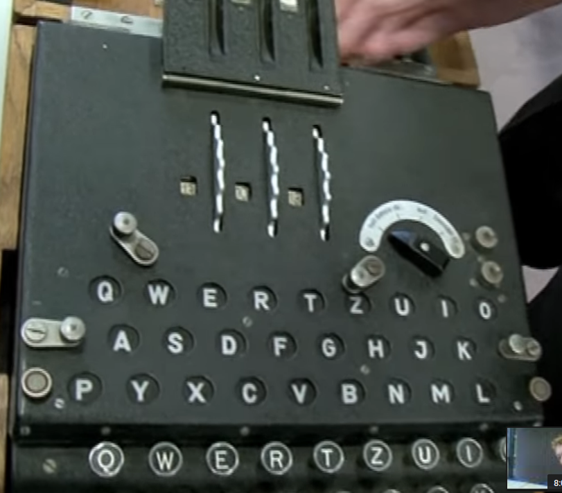

### Usage
```
python3 enigma.py <message> <r0> <r1> <r2>
```
where <message> is the string that you want to encode or decode. r0, r1 and r2 are three integers describing the rotors state of the enigma machine, as shown in the picture below.

Check [this vedio][this vedio] to learn more about enigma machine.



[this vedio]:https://www.youtube.com/watch?v=G2_Q9FoD-oQ
